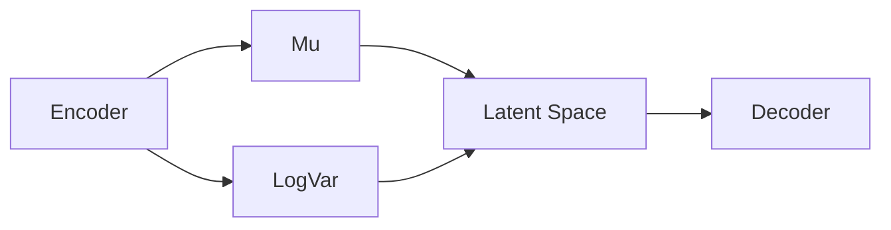

# Efficient Time-Series Classification via VAE-GMM Augmentation: A Novel Framework for Generating High-Quality Synthetic Data
Matthieu Olekhnovitch - July 2024

## Abstract

>Time-series classification remains a challenging task due to the inherent complexity and high dimensionality of sequential data. In this work, we introduce a novel and efficient data augmentation framework specifically designed for time series data, leveraging Variational Autoencoders (VAEs) with clustering constraints and Gaussian Mixture Models (GMMs). Our approach iteratively enhances the training dataset by generating synthetic samples that maintain both semantic coherence in the latent space and class-specific characteristics.
  
The process begins with training a VAE on the original time-series data, incorporating clustering constraints to ensure meaningful representation in the latent space. Subsequently, we fit a GMM to the clustered latent representations, which allows us to sample new latent points in a structured manner. When selecting points in the latent space, we expand the distribution to explore previously unexplored latent space volumes while maintaining control over the risk of expansion and preventing class overlapping. These new points are then decoded to produce synthetic time-series data, which are added to the training set.
  
This augmentation loop is repeated, progressively enriching the training data with high-quality synthetic samples that reflect the original data’s underlying distribution and class structure. Our method is not only computationally efficient but also significantly outperforms state-of-the-art augmentation techniques such as Fast AutoAugment and AutoAugment. Additionally, it is quick and easy to implement, making it highly accessible for practical use. Experimental results demonstrate substantial improvements in classification performance across multiple benchmark time series datasets. We also conducted an in-depth analysis to identify types of data that benefit significantly from augmentation and those that require minimal augmentation, thereby optimizing the process further.
  
By ensuring the generated data’s semantic integrity and class alignment, our method provides a robust, quick, and user-friendly augmentation strategy for enhancing time series classification models.

## 1 - Introduction
The classification of time series data is a fundamental problem with numerous applications across various domains such as finance, healthcare, and engineering. However, the inherent complexity and high dimensionality of time series data present significant challenges, often leading to overfitting and suboptimal model performance due to insufficient training data. Data augmentation has emerged as a crucial technique to mitigate these issues by artificially expanding the training dataset, thereby improving model generalization.

Traditional data augmentation methods for time series, such as window slicing, jittering, and scaling, often fail to capture the underlying temporal dependencies and semantic structure of the data. Recent advancements have introduced more sophisticated techniques like Fast AutoAugment and AutoAugment, which leverage search algorithms to automatically discover optimal augmentation policies. While effective, these methods are computationally intensive and may not always generate semantically meaningful augmented samples, particularly for complex time series data.

In this work, we propose a novel and efficient data augmentation framework that leverages Variational Autoencoders (VAEs) with clustering constraints and Gaussian Mixture Models (GMMs) to generate high-quality synthetic time series data. Our approach begins by training a VAE on the original time series data, ensuring that the latent space representation is both meaningful and semantically rich. We then fit a GMM to the latent space, enabling structured sampling of new latent points. By expanding the distribution to explore previously unexplored latent space volumes while maintaining control over the risk of expansion and class overlapping, we generate new data points that are both diverse and class-consistent.

This augmentation loop is iteratively applied, progressively enriching the training dataset with synthetic samples that reflect the original data's underlying distribution. Our method is not only quick and easy to implement but also significantly outperforms state-of-the-art augmentation techniques in terms of classification performance. Additionally, we conducted an in-depth analysis to identify the types of data that benefit most from augmentation and those that require minimal augmentation, thereby optimizing the process further.

The contributions of this paper are threefold:
1. We introduce a novel data augmentation framework that combines VAEs, clustering constraints, and GMMs to generate semantically meaningful time series data.

2. We demonstrate the efficiency and effectiveness of our method through extensive experiments, showing significant improvements over existing augmentation techniques and a high generalization potential.

3. We provide insights into the types of time series data that are highly amenable to augmentation, guiding future research and application.

## 2 - Related Work
### 2.1 - Auto Augmentation Techniques

Within the last 5 years, numerous auto augmentation techniques have flourished in the field of computer vision, aiming to automatically search for optimal data augmentation policies. These methods, such as **AutoAugment** and its costless little brother **Fast AutoAugment**, have shown remarkable improvements in image classification tasks by generating diverse and semantically meaningful augmented samples. However, their application to time series data has been limited due to the unique challenges posed by sequential data.
Indeed, time series data exhibit complex temporal dependencies and high-dimensional structures that require specialized augmentation strategies to preserve their semantic coherence. While traditional augmentation techniques like window slicing and scaling have been widely used, they often fail to capture the underlying dynamics of time series data, leading to suboptimal performance in classification tasks. Where a slight shift of an image can still be recognized by a human, a slight shift in a time series can completely alter its interpretation.
And without proper knowledge of the data's underlying structure, it is challenging to design effective augmentation policies that enhance model generalization.

In the following sections, we will discuss and quantify the limitations of existing augmentation techniques for time series data and introduce our novel framework that overcomes these challenges in the light of recent advancements in generative modeling and clustering.

### 2.2 - Generative Models for Data Augmentation

Generative models have gained significant attention in recent years for their ability to learn the underlying distribution of complex data and generate new samples. Variational Autoencoders (VAEs) and Generative Adversarial Networks (GANs) are two popular generative models that have been successfully applied to various domains, including image generation, text synthesis, and time series classification.

VAEs, in particular, have shown promise in capturing the latent structure of sequential data by learning a probabilistic mapping between the input space and a latent space. By imposing constraints on the latent space, such as clustering or regularization, VAEs can generate semantically meaningful samples that preserve the data's underlying structure. However, applying VAEs to time series data poses unique challenges due to the temporal dependencies and high dimensionality of sequential data.

## 3 - Methodology

### 3.1 - Problem Formulation

Given a dataset of time series samples $\mathcal{X} = \{x_1, x_2, ..., x_N\}$, where each sample $x_i$ belongs to a specific class $y_i \in \{1, 2, ..., C\}$, our goal is to generate synthetic time series data that can be used to augment the training set. The augmented dataset $\mathcal{X}_{\text{aug}}$ should contain additional samples that are both diverse and class-consistent, enhancing the model's generalization performance.

### 3.2 - Architecture Overview

Our data augmentation framework consists of two main components: a Variational Autoencoder (VAE) and a Gaussian Mixture Model (GMM). The VAE is responsible for learning a low-dimensional latent representation of the input time series data, while the GMM is used to model the distribution of the latent space and generate new samples.

First, we train the VAE on the original time series data with clustering constraints given as loss terms. The VAE learns to encode the input data into a latent space, ensuring that samples from the same class are clustered together at the same time as maintaining a meaningful representation of the data that let the decoder reconstruct the input data. Figure 1 illustrates the architecture of the VAE.

