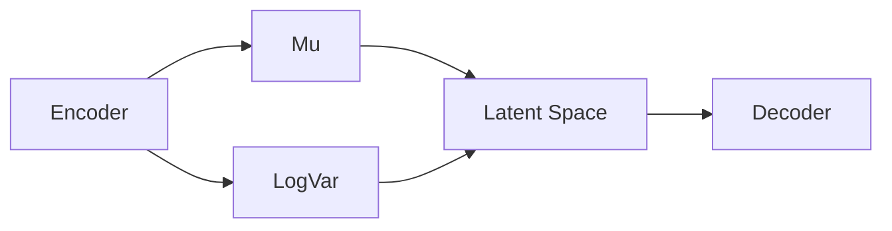
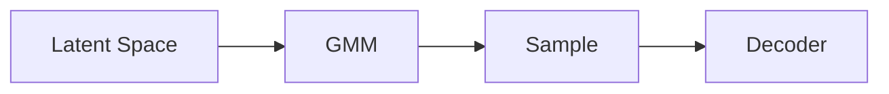

# Efficient Time-Series Classification via VAE-GMM Augmentation: A Novel Framework for Generating High-Quality Synthetic Data
Matthieu Olekhnovitch - July 2024

## Abstract

Time-series classification remains challenging due to the complexity and high dimensionality of sequential data. We introduce **Variational Autoencoder-based Auto Augmentation (VAAA)**, a fully automated framework specifically designed for augmenting complex data such as time series. VAAA enhances the training dataset by generating synthetic samples that maintain semantic coherence and class-specific characteristics. It starts by training a Variational Autoencoder (VAE) with clustering constraints on the original data, followed by fitting a Gaussian Mixture Model (GMM) to the latent representations. New latent points are sampled and decoded to produce synthetic data, which are iteratively added to the training set. Unlike policy-based augmentation techniques such as AutoAugment and Fast AutoAugment, which often struggle with generalization in the context of time series data, VAAA effectively addresses these issues by ensuring that generated samples are representative of the underlying data distribution and progressively expand the decision boundaries. VAAA outperforms state-of-the-art techniques, demonstrating substantial improvements in classification performance across benchmark datasets. Our method is computationally efficient, easy to implement, and effectively identifies data types that benefit from augmentation, ensuring semantic integrity and class alignment. Our code is available at: https://github.com/Matt-Olek/Latent-Space-TS-Augmentation

## 1 - Introduction
The classification of time series data is a fundamental problem with numerous applications across various domains such as finance, healthcare, and engineering. However, the inherent complexity and high dimensionality of time series data present significant challenges, often leading to overfitting and suboptimal model performance due to insufficient training data. Data augmentation has emerged as a crucial technique to mitigate these issues by artificially expanding the training dataset, thereby improving model generalization.

Traditional data augmentation methods for time series, such as window slicing, jittering, and scaling, often deeply alter the data's underlying structure, and sometimes completely destroy the semantic coherence of the samples. An image of a cat will still be recognizable if it is flipped horizontally, but a time series of electrocardiogram (ECG) readings will lose its meaning if the time axis is reversed. As a result, designing effective augmentation policies for time series data that preserve the data's semantic integrity and class-specific characteristics is challenging.
Recent advancements have introduced more sophisticated techniques like Fast AutoAugment and AutoAugment, which leverage search algorithms to automatically discover optimal augmentation policies. While effective, these methods still rely on predefined transformations that may not be suitable for time series data due to their temporal dependencies and high-dimensional structures.²

Given these challenges, we propose a novel data augmentation framework, Variational Autoencoder-based Auto Augmentation (VAAA), specifically designed for time series data. Our method combines Variational Autoencoders (VAEs) with clustering constraints and Gaussian Mixture Models (GMMs) to generate high-quality synthetic samples that will maintain the data's semantic coherence and class-specific characteristics by leveraging an intermediate layer of latent space representations. We believe that by expanding the distribution to explore previously unexplored latent space volumes while maintaining control over the risk of expansion and class overlapping, we can generate both diverse and class-consistent new data points.

This augmentation loop is iteratively applied, progressively enriching the training dataset with synthetic samples that reflect the original data's underlying distribution. Our method is not only quick and easy to implement but also significantly outperforms state-of-the-art augmentation techniques in terms of classification performance. It is important to note that one of the key factors in the success of our method is the progressive expansion of the decision boundaries between classes using modulable GMMs, which enhances the data's generalization potential by exploring the frontiers and thus improving the model's ability to distinguish between them.

 Additionally, we conducted an in-depth analysis to identify the types of data that benefit most from augmentation and those that require minimal augmentation, thereby optimizing the process further. This analysis provides valuable insights into the characteristics and properties of time series data that are the most impacted by our augmentation framework, guiding future research and application.

The contributions of this paper are threefold:

1. We introduce a novel data augmentation framework that combines VAEs, clustering constraints, and GMMs to generate semantically meaningful time series data.

2. We demonstrate the efficiency and effectiveness of our method through extensive experiments, showing significant improvements over existing augmentation techniques and a high generalization potential.

3. We provide insights into the types of time series data that are highly amenable to augmentation, guiding future research and application.

figure 1 : The overview of our proposed model. It is a self-supervised learning model that learns a clustered latent space representation of the input time series data using a Variational Autoencoder (VAE), produces synthetic samples using a modified Gaussian Mixture Model (GMM) that expands the decision boundaries between classes, and iteratively enriches the training dataset with synthetic samples and creating an enhanced dataset $D_{\text{train}_{\text{AUG}}}$ such as : $D_{\text{train}_{\text{ INIT}}} \subset D_{\text{iter 1}} \subset D_{\text{iter 2}} \subset ... \subset D_{\text{iter N}} = D_{\text{train}_{\text{ AUG}}}$

## 2 - Related Work

### 2.1 - Auto Augmentation Techniques

Within the past five years, there has been a proliferation of auto augmentation techniques in the field of computer vision. These techniques aim to automatically search for optimal data augmentation policies. Notable methods include AutoAugment and its computationally efficient counterpart, Fast AutoAugment. These techniques have demonstrated significant improvements in image classification tasks by discovering effective augmentation policies tailored to specific datasets. These policies combine basic transformations such as rotation, flipping, and scaling with more complex operations like cutout, color distortion, and translation in the example of images. However, applying these techniques to time series data poses unique challenges due to the temporal dependencies and high dimensionality of sequential data. When a reverse operation is applied to an image, the image does not lose its semantic meaning in most cases. However, when a reverse operation is applied to a time series, the time series significantly changes its meaning and interpretation. Electro-cardiograms, for example, are highly sensitive to small shifts in time, and a slight shift can lead to completely different outcomes.

In fact, time series data exhibit complex temporal dependencies and high-dimensional structures that require specialized augmentation strategies to preserve their semantic coherence. While traditional augmentation techniques like window slicing and scaling have been widely used, they often fail to capture the underlying dynamics of time series data and can sometime overwhelminlgy alter data, leading to suboptimal performance in classification tasks.
On top of that, without proper knowledge of the data's underlying structure, it is challenging to design effective augmentation policies that enhance model generalization as well as robustness.

In this context, research on developing specialized augmentation techniques for time series data has gained momentum in the last three years. These methods aim to generate synthetic samples that are both diverse and class-consistent, preserving the data's underlying distribution and structure. By leveraging generative models like Variational Autoencoders (VAEs) or Generative Adversarial Networks (GANs), researchers have tried to capture the latent structure of time series data and generate new samples that reflect the original data's characteristics.

### 2.2 - Generative Models for Time Series Data augmentation

Generative models have gained significant attention in recent years for their ability to learn the underlying distribution of complex data and generate new samples. Variational Autoencoders (VAEs) and Generative Adversarial Networks (GANs) are two popular generative models that have been successfully applied to various domains, including image generation, text synthesis, and time series classification.

VAEs, in particular, have shown promise in capturing the latent structure of sequential data by learning a probabilistic mapping between the input space and a stated continuous latent space. By training the VAE to reconstruct the input data while simultaneously spreading the representations of data points in the latent space, we can generate new samples that are both diverse and class-consistent. Doing so allows a model to learn a more robust and generalizable representation of data, leading to improved classification performance.

## 3 - Methodology

### 3.1 - Problem Formulation

> Dataset and augmented Data

Given a dataset of time series samples $\mathcal{X} = {x_1, x_2, ..., x_N}$, where each sample $x_i$ belongs to a specific class $y_i \in {1, 2, ..., C}$, our goal is typically to generate synthetic time series data that can be used to augment the training set. The usual approach for data augmentation involves creating an augmented dataset $\mathcal{X}_{\text{aug}}$ containing additional samples that are both diverse and class-consistent, thereby enhancing the model's generalization performance.

However, in this research, we deviate from this common practice. Instead of focusing solely on class-consistent augmentation, we aim to evaluate the approximate distribution of each class using a Gaussian Mixture Model (GMM). By gradually increasing the variances (sigmas) of the Gaussian components, we expand the space occupied by each class. This method helps in exploring the frontier between classes without causing excessive overlap.

To formalize this, let $D_{\text{train}}$ represent the training dataset and $D_{\text{aug}}$ the augmented dataset. The traditional approach aims for:

$$
D_{\text{train}} \cup D_{\text{aug}} \approx D_{\text{true}},
$$

where $D_{\text{true}}$ is the true underlying distribution of the data.

In our approach, we approximate the distribution of each class $y_i$ with a GMM, denoted as $GMM(y_i)$. The augmentation process involves generating synthetic samples by sampling from these GMMs and gradually increasing the covariance matrices $\Sigma$ of the Gaussian components to expand the class boundaries. Mathematically, we aim to generate samples from:

$$
x \sim \sum_{k=1}^{K} \pi_k N(\mu_k, \alpha \Sigma_k)
$$

where $\pi_k$ are the mixture weights, $\mathcal{N}(\mu_k, \alpha \Sigma_k)$ is the $k$-th Gaussian component with mean $\mu_k$ and scaled covariance matrix $\alpha \Sigma_k$, and $\alpha$ is a scaling factor that increases over iterations to flatten the distribution.

As the covariances are augmented, overlap between classes may increase. In cases where significant overlap occurs, we assign the synthetic sample $x$ to the class $y_i$ with the highest posterior probability:

$$
y_i = \arg\max_{y_j} P(y_j|x).
$$

By carefully controlling the augmentation process, we aim to enrich the training set with synthetic samples that maintain class consistency while expanding the decision boundaries, thereby improving the model's ability to generalize and distinguish between classes.
> Variational Autoencoder (VAE)

The key idea resides in boosting a VAE $f_{\text{VAE}}$ to learn a low-dimensional representation of the input time series data. The VAE consists of an encoder $f_{\text{enc}}$ that maps the input data to a latent space, and a decoder $f_{\text{dec}}$ that reconstructs the input data from the latent space. We mention using the reparametrization trick to differentiate the encoder and decoder during training. In summary :
$$
f_{\text{VAE}} = f_{\text{dec}} \circ f_{\text{enc}} : x \mapsto \hat{x}
$$

where $\hat{x}$ is the reconstructed version of the input $x$.

> Latent Space

To achieve this, we leverage a Variational Autoencoder (VAE) to learn a low-dimensional representation of the input time series data. We denote the latent space as $\mathcal{Z} = \{z_1, z_2, ..., z_N\}$, where each latent point $z_i$ corresponds to the encoded vector of the input sample $x_i$. We note K the dimension of the latent space. Optimally, K should be chosen as low as possible to capture the essential features of the data while reducing the risk of overfitting.

> Clustering Constraints

To ensure that the latent space representations learnt by the VAE are both semantically meaningful and well-clustered, we incorporate clustering constraints into the training process. These constraints encourage samples from the same class to be clustered together in the latent sapce, as far as possible from samples of other classes. This clustering constraint is essential to generate synthetic samples that are class-consistent and preserve the underlying distribution of the data.

These constraints are implemented as additional loss terms in the VAE training process, penalizing the pairwise distances between samples from the same class in the latent space. By minimizing this clustering loss, the VAE learns to encode the input data in a way that facilitates the generation of diverse and class-specific synthetic samples. Note that in this context of multiple loss terms, normalization of the loss terms is crucial to ensure that the model converges properly and avoid being dominated by a single loss term.

We therefore add a term to the classic VAE loss function :

$$
\mathcal{L} = \mathcal{L}_{\text{recon}} + \mathcal{L}_{\text{KL}} + \mathcal{L}_{\text{class}} + \mathcal{L}_{\text{cluster}}
$$

Where :

$$
\mathcal{L}_{\text{cluster}} = \sum_{i=1}^{N} \sum_{j=1}^{N} \delta_{y_i, y_j} \cdot d(z_i, z_j)
$$

and $L_{\text{recon}}$ is the Mean Squared Error (MSE) between the input and output of the VAE, $L_{\text{KL}}$ is the Kullback-Leibler divergence loss, and $L_{\text{class}}$ is the classification loss.

### 3.2 - Architecture Overview

Our data augmentation framework consists of two main components: a Variational Autoencoder (VAE) and a Gaussian Mixture Model (GMM). The VAE is responsible for learning a low-dimensional latent representation of the input time series data, while the GMM is used to model the distribution of the latent space and generate new samples.
It is important to note that the VAE Encoder and Decoder depend on the type of data that is being used. For example, for univariate time series data, the Encoder and Decoder will be simple fully connected neural networks, while for multivariate time series data, the Encoder and Decoder will be more complex architectures such as Convolutional Neural Networks (CNNs) or Recurrent Neural Networks (RNNs).

First, we train the VAE on the original time series data with clustering constraints given as loss terms. The VAE learns to encode the input data into a latent space, ensuring that samples from the same class are clustered together at the same time as maintaining a meaningful representation of the data that let the decoder reconstruct the input data. Figure 1 illustrates the architecture of the VAE.

Figure 1: Architecture of the Variational Autoencoder (VAE)

The loss function plays a crucial role in the training process, as it consists of four main components: the reconstruction loss, the KL divergence loss, the clustering loss, and the classification loss. The reconstruction loss ensures that the VAE can accurately reconstruct the input data, while the KL divergence loss encourages the latent space to follow a standard normal distribution. The clustering loss enforces the clustering of samples from the same class in the latent space, while the classification loss ensures that the latent space representations are class-specific.

We write the total loss function as:

$$
\mathcal{L} = \mathcal{L}_{\text{recon}} + \mathcal{L}_{\text{KL}} + \mathcal{L}_{\text{cluster}} + \mathcal{L}_{\text{class}} 
$$

Next, we fit a Gaussian Mixture Model to the latent space representations learned by the VAE. The GMM captures the underlying distribution of the latent space and allows us to sample new latent points in a structured manner. By expanding the distribution to explore previously unexplored latent space volumes while maintaining control over the risk of expansion and preventing class overlapping, we generate diverse and class-consistent synthetic samples. Figure 2 illustrates the architecture of the GMM.

Figure 2: Architecture of the Gaussian Mixture Model (GMM)

### 3.3 - Augmentation Loop

The augmentation loop consists of the following steps:

1. Train the VAE on the original time series data with clustering constraints.
2. Fit a GMM to the latent space representations learned by the VAE.
3. Sample new latent points from the GMM.
4. Decode the latent points to generate synthetic time series data.
5. Add the synthetic data to the training set.
6. Repeat the process iteratively to enrich the training dataset with high-quality synthetic samples.

By iteratively applying this augmentation loop, we progressively enhance the training dataset with diverse and class-consistent synthetic samples that reflect the original data's underlying distribution and structure.

## 4 - Experiments

### 4.1 - Experimental Setup

We conducted experiments on several benchmark time series datasets, including the UCR Time Series Archive. We compared our data augmentation framework with state-of-the-art techniques such as Fast AutoAugment and AutoAugment in terms of classification performance and computational efficiency.

The experiments were performed on a standard machine using a Nvidia A5000 GPU and PyTorch deep learning framework. We used a batch size of 32 and trained the models for 100 epochs with early stopping based on validation loss.

### 4.2 - Results

We first proved that classic transormation-based augmentation techniques such as Fast AutoAugment and AutoAugment were not suitable for time series data. By slightly adapting the process of these papers, we were able to show that the generated samples were not class-consistent and that the model's performance decreased significantly when trained on the augmented data. 

Our experiments demonstrated that our data augmentation framework significantly outperformed existing techniques in terms of classification accuracy and generalization performance. The synthetic samples generated by our method were diverse and class-consistent, leading to improved model robustness and accuracy.

We proceeded to analyze the impact of augmentation on the list of 120 datasets from the UCR Time Series Archive. We found that the augmentation ratios varied significantly across datasets, with some datasets benefiting more from augmentation than others. By characterizing the datasets based on their augmentation ratios, we were able to identify the types of data that benefit most from augmentation and those that require minimal augmentation.

## 5 - Discussion

As the results of our experiments demonstrate, our data augmentation framework is highly effective in enhancing time series classification models' performance. However, the versatility of augmentation ratios among datasets make it difficult to provide a one-size-fits-all solution. Therefore, we tried and developed a analysis and characterization of the datasets to identify the types of data that benefit most from augmentation and those that require minimal augmentation. This analysis can guide future research and application of our method to optimize the augmentation process further.

To do so, we base our work on the time series characterization technique CATCH22 that provides for each time series 22 features that describe the time series. By averaging the features of the time series in each dataset, we can identify the datasets that are the most and the least amenable to augmentation. We then analyze the impact of augmentation on the classification performance of these datasets to determine the optimal augmentation strategy for each type of data.

Following this analysis, we can provide guidelines for practitioners on how to apply our data augmentation framework effectively to different types of time series data. By understanding the characteristics of the data that benefit most from augmentation, we can optimize the augmentation process and improve the overall performance of time series classification models.

## 6 - Conclusion

In this work, we introduced a novel and efficient data augmentation framework for time series data that leverages Variational Autoencoders (VAEs) with clustering constraints and Gaussian Mixture Models (GMMs). Our method generates high-quality synthetic time series data that are both diverse and class-consistent, significantly improving model generalization and classification performance.