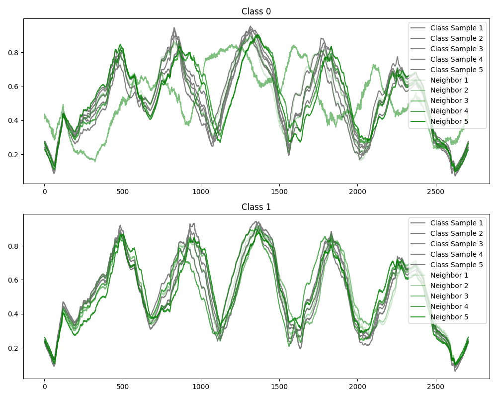

# Latent Space TS Augmentation
 
 This repository aims at implementing a simple and efficient method to augment time series data using a latent space. The method is based on the idea of using a variational autoencoder (VAE) to learn a latent space representation of the time series data. The latent space is then used to generate new time series data by sampling from the latent space.

 The method is implemented using :
    - [Python 3.12.3](https://www.python.org/)
    - [PyTorch](https://pytorch.org/)
    - [NumPy](https://numpy.org/)
    - [Pandas](https://pandas.pydata.org/)

## Installation
All required packages are listed in the `requirements.txt` file. You can install them using the following command:
```bash
pip install -r requirements.txt
```

## Usage

This augmentation method leverages a VAE alongside a classification model (ResNet). The VAE, trained on the original time series data, learns a latent space representation. New time series data is generated by adding noise to true latent space points and assigning them the original labels. This augmented data trains the classification model. We compare a baseline approach, where the model is trained on original data, to an augmented approach, where the model is trained on original plus generated data.

The datasets used in this repository are from the [UCR Time Series Classification Archive](https://www.cs.ucr.edu/~eamonn/time_series_data_2018/). They are stored in the `data/` folder and loaded using the custom 'loader.py' script. 

Feel free to add your **own** datasets to the `data/` folder and load them using and **adapted** version of the 'loader.py' script.

To run the code, you can use the following command:
```bash
python LSTSAUG/main.py
```

### Configuration Parameters

The `config.py` file contains various parameters that are crucial for setting up and running the project. Below is an explanation of each parameter:

#### Data Parameters

- **`DATA_DIR`**: Specifies the directory path where the dataset is stored.
- **`RESULTS_DIR`**: Defines the directory where the results of the experiments will be saved.
- **`MODEL_DIR`**: Indicates the directory where the trained models will be stored.
- **`DATASET`**: The specific dataset to be used for training and evaluation.

#### Model Parameters

- **`SEED`**: A seed value for random number generation to ensure reproducibility.
- **`VAE_NUM_EPOCHS`**: Number of epochs for training the Variational Autoencoder (VAE).
- **`NUM_EPOCHS`**: Total number of epochs for the entire training process.
- **`BATCH_SIZE`**: The number of samples per batch during training.
- **`LATENT_DIM`**: The dimensionality of the latent space in the VAE.
- **`LEARNING_RATE`**: The learning rate for the optimizer.
- **`WEIGHT_DECAY`**: The weight decay (L2 regularization) value for the optimizer.

#### Augmentation Parameters

- **`AUGMENT_PLOT`**: A boolean flag to indicate whether to plot the augmentations.
- **`TEST_AUGMENT`**: A boolean flag indicating whether to apply augmentations during testing.
- **`USE_TRAINED`**: A boolean flag to indicate whether to use a pre-trained model.
- **`BASELINE`**: A boolean flag indicating whether to use baseline (non-augmented) data.
- **`NUM_SAMPLES`**: The number of samples to generate for each augmentation.
- **`NOISE`**: The noise level to be added during augmentation.
- **`ALPHA`**: The alpha value for augmentation operations.

#### Weights & Biases (WandB) Parameters

- **`WANDB`**: A boolean flag to indicate whether to use Weights & Biases for experiment tracking.
- **`WANDB_PROJECT`**: The name of the Weights & Biases project.

## Results

The results of the experiments are stored in the `results/` folder. The following plots are generated during the training and evaluation process:

- **Latent Space Neigborhoods**: This plot shows the latent space neighborhoods of the original and augmented data points :




